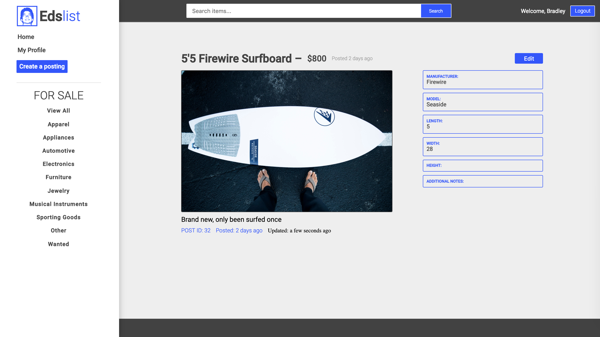

# Edslist

A Craigslist-inspired CMS built with React and PostgreSQL in a Docker container and deployed on AWS 

## Features

- Full authentication & Password encryption
- Client-side & Server-side Session Management
- File upload support
- Search filtering

## Technologies & Frameworks

* React
* React-router
* Redux
* Redux-thunk
* AWS
* Express
* Express Session
* Redis
* Passport.js
* Bcryptjs
* Bookshelf.js
* Knex.js
* PostgreSQL
* Docker
* Sass
* Moment.js
* Multer

## Screenshots

___

___

___

